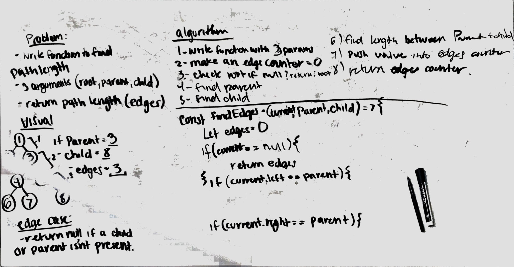

# findPathLength

write a function to find the path length (edges from parent to child)

## Approach 
traverse the tree till i find the parent. then keep going till the child is hit. return the number of edges between them. 

